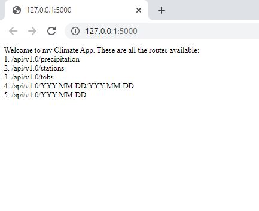

# SQLAlchemy / Flask App - Climate Analysis

## Climate Analysis and Exploration

I have used Python and SQLAlchemy to do basic climate analysis and data exploration of a climate database. The analysis was completed using SQLAlchemy ORM queries, Pandas, and Matplotlib.

* I have used SQLAlchemy `create_engine` to connect to my sqlite database.

* I have used SQLAlchemy `automap_base()` to reflect my tables into classes and saved a reference to those classes called `Station` and `Measurement`.

### Step 1:  Precipitation Analysis

* I designed a query to retrieve the last 12 months of precipitation data.

* I selected only the `date` and `prcp` values.

* I loaded the query results into a Pandas DataFrame and set the index to the date column.

* I sorted the DataFrame values by `date`.

* I plotted the results using the DataFrame `plot` method.

* I used Pandas to print the summary statistics for the precipitation data.

### Step 2: Station Analysis

* I designed a query to calculate the total number of stations.

* I designed a query to find the most active stations.

  * I listed the stations and observation counts in descending order.

  * I determined the station that has the highest number of observations.

  * I leveraged function such as `func.min`, `func.max`, `func.avg`, and `func.count` in my queries.

* I designed a query to retrieve the last 12 months of temperature observation data (TOBS).

  * I filtered by the station with the highest number of observations.

  * I plotted the results as a histogram with `bins=12`.

## Step 3 - Climate App

After completing my initial analysis, I designed a Flask API based on the queries that I developed.

### Routes

* `/`

  * Home page.

  * I listed all routes that are available.

* `/api/v1.0/precipitation`

  * I converted the query results to a dictionary using `date` as the key and `prcp` as the value.

  * I returned the JSON representation of your dictionary.

* `/api/v1.0/stations`

  * I returned a JSON list of stations from the dataset.

* `/api/v1.0/tobs`
  * I queried the dates and temperature observations of the most active station for the last year of data.
  
  * I returned a JSON list of temperature observations (TOBS) for the previous year.

* `/api/v1.0/<start>` and `/api/v1.0/<start>/<end>`

  * I returned a JSON list of the minimum temperature, the average temperature, and the max temperature for a given start or start-end range.

  * When given the start only, I calculated `TMIN`, `TAVG`, and `TMAX` for all dates greater than and equal to the start date.

  * When given the start and the end date, I calculated the `TMIN`, `TAVG`, and `TMAX` for dates between the start and end date inclusive.

  -------
  
  Contact: jorge.arriola.villafuerte@gmail.com
